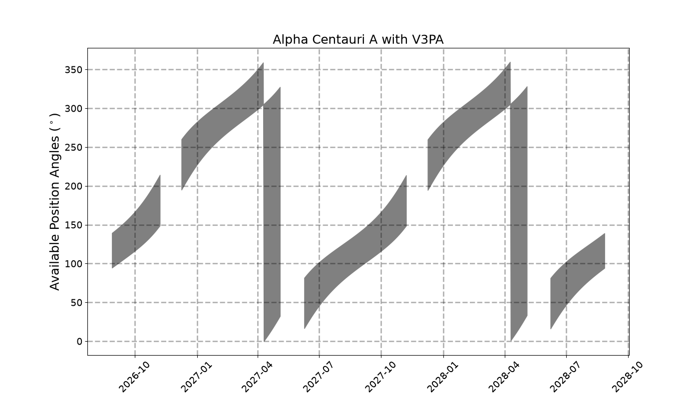

# HWO General Target Visibility Tool (hwo_gtvt)

HWO requires shielding from the Sun for operation, which limits the available position angles observable at a given time. This script calculates the allowed position angles for a given Right Ascension and Declination for each instrument on the telescope. Currently the only allowed instrument is V3PA.

This is a fork of the JWST General Target Visibility Tool (https://github.com/spacetelescope/jwst_gtvt). This tool parameterizes spacecraft-dependent constants like sun angle and roll.

# Dependencies

This tool requires a few packages:

* astropy

* astroquery (for moving target support)

* docopt

* maplotlib

* numpy

* pysiaf

* pandas

* tabulate

# Installation

You can clone the respository from GitHub and install the tool inside a virtual environment:

	$ python3 -m venv .venv # create virtual environment if you don't have one already
	$ source .venv/bin/activate # or activate.csh, or activate.fish
	$ cd /path/to/jwst_gtvt_hwo # path to repository
	$ pip install .

(The period in the last command is required and is not punctuation.)

# Usage

There are two scripts available: `hwo_gtvt` for fixed targets and `hwo_mtvt` for moving targets. The arguments and options are the same as the JWST General Target Visibility Tool, except the only allowed instrument is V3PA.

# Example
```
hwo_gtvt --ra=219.910043 --dec=-60.833976
         --target_name="Alpha Centauri A"
         --instrument=v3pa
         --write_plot=hwo_gtvt_plot_alpha_centauri_a.png
```

This will result in the following plot:



and the following output to the terminal:
```
+-------------------------------------------------+
| HWO General Target Visibility Tool              |
+-------------------------------------------------+
| Runtime/Date: 2026-08-27 12:51:20.577044        |
+-------------------------------------------------+
| Version Number: 0.1.dev390+ga0c26f508.d20260827 |
+-------------------------------------------------+
RA: 219.910043  Dec: -60.833976  Ecliptic Latitude: -42.59271617325206
----------------------------------------------------------------------

Checked Interval [2026-08-27 16:51:19.355286, 2028-08-27 04:51:19.355286]

+----------------+--------------+-------------------+------------------+----------------+
| Window Start   | Window End   |   Window Duration |   V3 Angle Start |   V3 Angle End |
|----------------+--------------+-------------------+------------------+----------------|
| 2026-08-28     | 2026-11-07   |                71 |         116.944  |      181.568   |
| 2026-12-09     | 2027-05-04   |               146 |         227.507  |      359.848   |
| 2027-06-09     | 2027-11-07   |               151 |          49.0815 |      181.206   |
| 2027-12-09     | 2028-05-04   |               147 |         227.096  |        0.77218 |
| 2028-06-08     | 2028-08-27   |                80 |          48.694  |      116.632   |
+----------------+--------------+-------------------+------------------+----------------+
+------------+-------------+-------------+
| Date       |   V3 Max PA |   V3 Min PA |
|------------+-------------+-------------|
| 2026-08-28 | 139.371     |     94.5159 |
| 2026-08-29 | 140.046     |     95.1583 |
| 2026-08-30 | 140.727     |     95.7986 |
| 2026-08-31 | 141.412     |     96.4368 |
| 2026-09-01 | 142.104     |     97.0733 |
| 2026-09-02 | 142.801     |     97.7082 |
| 2026-09-03 | 143.505     |     98.3417 |
| 2026-09-04 | 144.215     |     98.974  |
| 2026-09-05 | 144.932     |     99.6054 |
| 2026-09-06 | 145.656     |    100.236  |
| 2026-09-07 | 146.387     |    100.866  |
| 2026-09-08 | 147.126     |    101.496  |
| 2026-09-09 | 147.872     |    102.125  |
| 2026-09-10 | 148.627     |    102.755  |
| 2026-09-11 | 149.389     |    103.384  |
| 2026-09-12 | 150.16      |    104.015  |
| 2026-09-13 | 150.939     |    104.646  |
| 2026-09-14 | 151.728     |    105.277  |
| 2026-09-15 | 152.526     |    105.91   |
| 2026-09-16 | 153.333     |    106.545  |
| 2026-09-17 | 154.15      |    107.181  |
| 2026-09-18 | 154.978     |    107.818  |
...
```

# Parameterization

In `/hwo_gtvt/data/`, the `parameters.json` file parameterizes various spacecraft constants. All angles in this file are in degrees. The file currently parameterizes the HWO, based on info from the following paper: https://arxiv.org/pdf/2602.11046.
